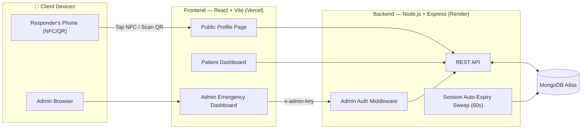
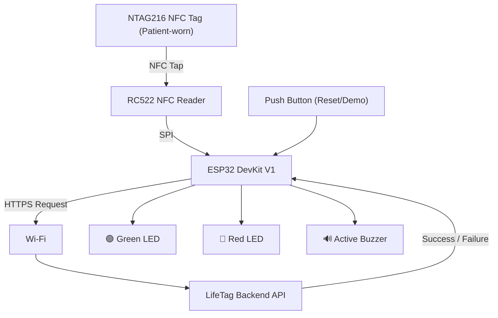
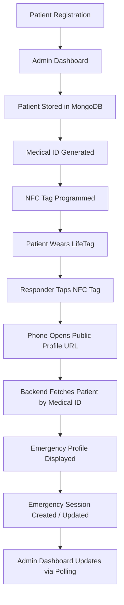

<div align="center">


# LifeTag

### **One Tap Can Save a Life.**

Smart NFC-Based Emergency Medical Identity System

[](https://react.dev/)
[](https://www.typescriptlang.org/)
[](https://vitejs.dev/)
[](https://tailwindcss.com/)
[](https://nodejs.org/)
[](https://www.mongodb.com/atlas)
[](https://www.espressif.com/)
[](https://vercel.com/)
[](https://render.com/)
[](#license)

[Live Demo](https://lifetag-pi.vercel.app/) &nbsp;•&nbsp;
[Demo Video](https://drive.google.com/file/d/1PnC9blpdH6YbZ5bI4NWUHQUirQjdpbLZ/view?usp=drive_link) &nbsp;•&nbsp;
[Presentation](https://drive.google.com/file/d/1GyOHvAd7lpZAbMiEDKnjWMzsFPOtR1hi/view?usp=sharing)

</div>

---

## Overview

**LifeTag** is a Smart NFC-Based Emergency Medical Identity System that gives first responders instant access to a patient's critical medical information — with no app, no login, and no delay.

Patients (or their caregivers) register through a secure web dashboard. Each patient receives a unique **Medical ID**, linked to a public emergency profile page. That profile URL is programmed onto an **NFC tag**, worn or carried by the patient. During an emergency, anyone with an NFC-enabled smartphone simply **taps the tag** — the browser opens the patient's emergency profile automatically.

Every profile access is also logged as an **Emergency Session**, visible only to authenticated administrators through a live-updating monitoring dashboard.

A working **ESP32 + RC522** hardware prototype demonstrates the physical NFC scanning experience end-to-end.

## Problem Statement

In a medical emergency, the first few minutes matter most — yet responders typically have **zero information** about the patient's blood type, allergies, medications, or emergency contacts. Locked phones, unknown medical history, and unconscious patients turn routine emergencies into guesswork.

## Solution

LifeTag removes every barrier between a responder and the information they need:

- No app to install.
- No login or account required.
- No signal dependency for the tap itself once the page loads.
- One tap (NFC) or one scan (QR) → instant emergency profile.

## Features

| Category | Feature |
|---|---|
|  Patient Management | Create, view, edit, and manage patient medical profiles from a secure dashboard |
|  Unique Medical ID | Auto-generated, unique identifier (`LT-YYYY-XXXX`) per patient |
|  NFC / QR Access | Public emergency profile opens instantly via NFC tap or QR scan |
|  Emergency Profile | Blood group, allergies, chronic conditions, medications, emergency contacts, organ donor status |
|  Emergency Sessions | Every profile view auto-creates a time-boxed (1-hour) emergency session |
|  Admin Monitoring | Live dashboard of active & past emergency sessions, polling every 10s |
|  Hardware Prototype | ESP32 + RC522 reader demonstrates real NFC tag scanning and backend sync |
|  Modern UI | Responsive, accessible, motion-enhanced interface built with Tailwind + Framer Motion |

## Key Highlights

- **Sub-second access** — no app install, no authentication wall for responders.
- **Deterministic Medical IDs** generated server-side on patient creation.
- **Self-expiring emergency sessions** — auto-close after exactly 1 hour via a background sweep.
- **Real-time-feeling admin dashboard** via lightweight polling (no infra overhead of WebSockets).
- **Privacy-first** — the public profile route never exposes session, admin, or statistics data.
- **Full hardware-to-cloud loop** — physical NFC tap → cloud API → live dashboard update.

## Software Architecture



## Hardware Architecture



## System Workflow



## Folder Structure

```
LifeTag/
├── frontend/          React + TypeScript + Vite + Tailwind client
├── backend/           Node.js + Express + MongoDB API server
├── LifeTag_ESP32/      ESP32 + RC522 hardware firmware
└── README.md
```

> See [Project Structure (Detailed)](#project-structure-detailed) for the full tree.

## Technology Stack

<table>
<tr><th>Layer</th><th>Technology</th></tr>
<tr><td><b>Frontend</b></td><td>React, TypeScript, Vite, Tailwind CSS, React Router, Axios, Framer Motion, Lucide Icons</td></tr>
<tr><td><b>Backend</b></td><td>Node.js, Express.js, Mongoose</td></tr>
<tr><td><b>Database</b></td><td>MongoDB Atlas</td></tr>
<tr><td><b>Hardware</b></td><td>ESP32 DevKit V1, RC522 NFC Reader, NTAG216 NFC Tags, Buzzer, LEDs, Push Button</td></tr>
<tr><td><b>Deployment</b></td><td>Vercel (Frontend), Render (Backend)</td></tr>
</table>

## Screenshots


## Hardware Components

| Component | Purpose |
|---|---|
| ESP32 DevKit V1 | Microcontroller running the demo reader station; connects to Wi-Fi and calls the backend API |
| RC522 NFC Reader | Reads the NTAG216 tag via SPI when a LifeTag is presented |
| NTAG216 NFC Tags | Passive tag storing the encoded link to the patient's public profile |
| Active Buzzer | Audible confirmation on a successful/failed scan |
| Green LED | Indicates a successful tag read / valid patient found |
| Red LED | Indicates a failed read / patient not found |
| Push Button | Resets the demo station between simulated scans |

<details>
<summary><b>Circuit / Wiring Notes</b></summary>

- RC522 communicates with the ESP32 over SPI (SDA, SCK, MOSI, MISO, RST, GND, 3.3V).
- LEDs and buzzer are driven from GPIO pins with current-limiting resistors.
- The push button is wired with an internal pull-up for manual reset.
- Full pin mapping lives in [`LifeTag_ESP32/config.h`](./LifeTag_ESP32/config.h).

</details>

## Installation Guide

### Prerequisites

- Node.js ≥ 18
- npm
- A MongoDB Atlas cluster (or local MongoDB instance)
- (Optional) Arduino IDE / PlatformIO for the ESP32 firmware

```bash
git clone https://github.com/<your-org>/LifeTag.git
cd LifeTag
```

## Backend Setup

```bash
cd backend
npm install
cp .env.example .env   # then fill in real values
npm run dev             # tsx watch server.ts
```

The API runs on `http://localhost:5001` by default.

## Frontend Setup

```bash
cd frontend
npm install
cp .env.example .env    # then fill in real values
npm run dev              # vite
```

The app runs on `http://localhost:5173` by default.

## Environment Variables

<details>
<summary><b>Backend — <code>backend/.env</code></b></summary>

| Variable | Description |
|---|---|
| `PORT` | Port the Express server listens on (default `5001`) |
| `NODE_ENV` | `development` or `production` |
| `MONGO_URI` | MongoDB Atlas connection string |
| `ADMIN_SECRET` | Shared secret required (as `x-admin-key` header) to access emergency monitoring endpoints |

</details>

<details>
<summary><b>Frontend — <code>frontend/.env</code></b></summary>

| Variable | Description |
|---|---|
| `VITE_API_URL` | Base URL of the deployed/local backend API (e.g. `http://localhost:5001`) |

</details>

> Never commit real `.env` files. Only `.env.example` files should be tracked in version control.

## Running the Project

1. Start MongoDB Atlas (or local MongoDB).
2. Start the backend: `cd backend && npm run dev`.
3. Start the frontend: `cd frontend && npm run dev`.
4. Visit `http://localhost:5173` to create a patient profile.
5. Open `/profile/<medicalId>` to view the public emergency profile.
6. Open `/admin/emergency` and enter the `ADMIN_SECRET` to view live emergency sessions.

## API Overview

<details>
<summary><b>Patient Endpoints — <code>/api/patients</code></b></summary>

| Method | Endpoint | Description |
|---|---|---|
| `GET` | `/api/patients` | List all patients |
| `POST` | `/api/patients` | Create a new patient profile |
| `GET` | `/api/patients/search?q=` | Search patients by name |
| `GET` | `/api/patients/:medicalId` | Get a patient by Medical ID |
| `PUT` | `/api/patients/:medicalId` | Update a patient by Medical ID |
| `DELETE` | `/api/patients/:medicalId` | Delete a patient by Medical ID |

</details>

<details>
<summary><b>Emergency Session Endpoints — <code>/api/emergency</code></b></summary>

| Method | Endpoint | Auth | Description |
|---|---|---|---|
| `POST` | `/api/emergency/start` | Public | Starts or extends an emergency session for a Medical ID |
| `GET` | `/api/emergency/active` | Admin | Lists all currently active emergency sessions |
| `GET` | `/api/emergency/history` | Admin | Lists closed/past emergency sessions |
| `PATCH` | `/api/emergency/close/:id` | Admin | Manually closes an active session |

Admin-protected routes require an `x-admin-key` header matching the server's `ADMIN_SECRET`.

</details>

## Database Schema Overview

<details>
<summary><b>Patient</b></summary>

| Field | Type | Notes |
|---|---|---|
| `medicalId` | String | Unique, auto-generated (`LT-YYYY-XXXX`) |
| `fullName` | String | Required |
| `dateOfBirth` | Date | Optional |
| `gender` | String | `Male` \| `Female` \| `Other` |
| `bloodGroup` | String | Required, one of the 8 standard blood groups |
| `allergies` | String[] | |
| `chronicConditions` | String[] | |
| `currentMedications` | String[] | |
| `emergencyContacts` | Array `{ name, relation, phone }` | |
| `primaryPhysician` | `{ name, hospital, phone }` | Optional |
| `organDonor` | Boolean | |
| `notes` | String | |

</details>

<details>
<summary><b>EmergencySession</b></summary>

| Field | Type | Notes |
|---|---|---|
| `patientId` | ObjectId | Reference to `Patient` |
| `medicalId` | String | Indexed |
| `patientName`, `bloodGroup` | String | Denormalized snapshot for fast dashboard reads |
| `status` | String | `ACTIVE` \| `CLOSED` |
| `startedAt`, `expiresAt`, `lastViewedAt`, `closedAt` | Date | |
| `viewCount` | Number | Incremented on repeat views within the same active session |
| `createdBy` | String | e.g. `PUBLIC_NFC` |
| `duration` | Number | Seconds, computed on close |

</details>

## Deployment

| Service | Platform | URL |
|---|---|---|
| Frontend | Vercel | [lifetag-pi.vercel.app](https://lifetag-pi.vercel.app/) |
| Backend | Render | Configured via `VITE_API_URL` |

- **Demo Video:** [Watch here](https://drive.google.com/file/d/1PnC9blpdH6YbZ5bI4NWUHQUirQjdpbLZ/view?usp=drive_link)
- **Presentation (PPT):** [View here](https://drive.google.com/file/d/1GyOHvAd7lpZAbMiEDKnjWMzsFPOtR1hi/view?usp=sharing)

## Future Scope

- Full admin authentication (per-user accounts, JWT/session-based) beyond the shared-key gate.
- Native mobile companion app with offline-cached emergency profiles.
- Hospital/EMS system integrations (HL7/FHIR compatibility).
- Multi-language emergency profile rendering.
- Location-tagging on emergency session creation for responder dispatch context.
- SMS/push notification to emergency contacts the moment a session starts.

## Security & Privacy

- The **public emergency profile** exposes only medical information required in an emergency — never session history, admin data, or statistics.
- **Emergency Sessions** and the **Admin Dashboard** are accessible only with a valid `x-admin-key` matching the server-side `ADMIN_SECRET`.
- Sessions **auto-expire after 1 hour**, both lazily on read and via a background sweep, and are never deleted — only closed — preserving an audit trail.
- No patient data is ever cached client-side beyond the active browser session.

> This is a hackathon prototype. Before any real-world clinical use, it must undergo a full security review, HIPAA/GDPR-equivalent compliance assessment, and a move to per-admin authentication.

## Project Structure (Detailed)

```
LifeTag/
│
├── frontend/
│   ├── src/
│   │   ├── api/               # Centralized API clients (emergency, patients)
│   │   ├── components/
│   │   │   ├── ui/             # Reusable design-system primitives (Button, Card, Badge, Toast...)
│   │   │   └── emergency/      # Emergency dashboard components
│   │   ├── pages/              # HomePage, DashboardPage, CreateProfilePage, EditProfilePage,
│   │   │                        # PublicProfilePage, AdminEmergencyPage
│   │   ├── types/              # Shared TypeScript interfaces
│   │   ├── App.tsx
│   │   └── main.tsx
│   ├── index.html
│   ├── vite.config.ts
│   ├── tailwind.config.js
│   └── package.json
│
├── backend/
│   ├── src/
│   │   ├── config/             # Database connection
│   │   ├── controllers/        # Patient & Emergency Session controllers
│   │   ├── middleware/         # Error handler, admin auth
│   │   ├── models/             # Patient, EmergencySession (Mongoose schemas)
│   │   ├── routes/             # /api/patients, /api/emergency
│   │   └── services/           # Emergency session business logic
│   ├── server.ts
│   └── package.json
│
├── LifeTag_ESP32/
│   ├── LifeTag_ESP32.ino
│   ├── rfid.cpp / rfid.h        # RC522 NFC reading
│   ├── api.cpp / api.h          # Backend HTTP communication
│   ├── indicators.cpp / h       # LED + buzzer feedback
│   ├── wifi_manager.cpp / h     # Wi-Fi connection handling
│   ├── config.h                 # Pin mapping & constants
│   └── uid_map.h                # Tag UID → Medical ID mapping
│
└── README.md
```

## Contributors

<table>
<tr>
<td align="center">
<a href="https://github.com/dhaks-cse">
<br />
<sub><b>dhaks-cse</b></sub>
</a>
</td>
<td align="center">
<a href="https://github.com/meghashree-ms-svg">
<br />
<sub><b>meghashree-ms-svg</b></sub>
</a>
</td>
</tr>
</table>

> Add the rest of the team here — this section was inferred from repository collaborators. Update names, roles, and profile links as needed.

## License

This project is licensed under the **MIT License**.

```
MIT License

Copyright (c) 2026 LifeTag

Permission is hereby granted, free of charge, to any person obtaining a copy
of this software and associated documentation files (the "Software"), to deal
in the Software without restriction, including without limitation the rights
to use, copy, modify, merge, publish, distribute, sublicense, and/or sell
copies of the Software, subject to the following conditions:

The above copyright notice and this permission notice shall be included in
all copies or substantial portions of the Software.

THE SOFTWARE IS PROVIDED "AS IS", WITHOUT WARRANTY OF ANY KIND, EXPRESS OR
IMPLIED, INCLUDING BUT NOT LIMITED TO THE WARRANTIES OF MERCHANTABILITY,
FITNESS FOR A PARTICULAR PURPOSE AND NONINFRINGEMENT.
```

> Add a `LICENSE` file at the repository root with this text to make it effective on GitHub.

## Acknowledgements

- Built for a healthcare innovation hackathon.
- Icons by [Lucide](https://lucide.dev/).
- Animations by [Framer Motion](https://www.framer.com/motion/).
- Hosting by [Vercel](https://vercel.com/) and [Render](https://render.com/).
- Database by [MongoDB Atlas](https://www.mongodb.com/atlas).

---

<div align="center">

**LifeTag** — *One Tap Can Save a Life.*

</div>
